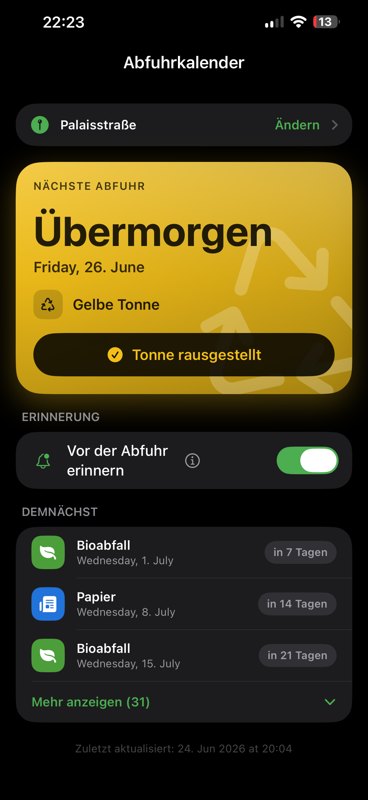

# Abfuhrkalender Detmold

**Die Müllabfuhr-Termine deiner Straße – schön und auf einen Blick.**

Eine moderne iOS-App (SwiftUI), die aus dem bestehenden Abfuhrkalender der Stadt
Detmold ein erstklassiges iPhone-Erlebnis macht: Nächster Termin sofort sichtbar,
ein Wecker am Vorabend, ein Homescreen-Widget - ohne Accounts, ohne
Server, ohne Tracking.

> **Plattform:** iOS 16+ · **Stack:** SwiftUI, async/await · **Abhängigkeiten:** keine ·
> **Status:** lauffähig auf echtem Gerät (iPhone 13, iOS 27)

<p align="center">
  
</p>

---

## Die Idee

Jede Woche dieselbe Frage: *„Welche Tonne muss heute Abend raus?"* Die Stadt
Detmold stellt die Termine bereits als iCal-Export bereit – aber ein Kalender-Abo
beantwortet die Frage nicht auf einen Blick und erinnert nicht zuverlässig.

Diese App schließt genau diese Lücke: Sie zeigt **den nächsten Abfuhrtermin groß
und farbig**, schlägt die **Straße automatisch per Standort** vor und **erinnert 
auf Wunsch am Vorabend wie ein Wecker** - deutlich genug, dass man es im Schlaf- und
Fokusmodus nicht verpasst - bis man bestätigt, dass die Tonne draußen steht.

## Highlights

- 🗑️ **Nächste Abfuhr auf einen Blick** – große Karte mit „Heute/Morgen/in N Tagen",
  Abfallart und passender Tonnenfarbe; darunter die kommenden Termine.
- 📍 **Straße per GPS vorgeschlagen** – beim Öffnen der Auswahl wird die Straße am
  Standort vorausgefüllt; meist genügt ein Tippen (frei überschreibbar).
- ⏰ **Echter Wecker statt leiser Push** – am Vorabend 21:00 / 21:30 / 22:00 / 22:30,
  klingelt laut (durchbricht Stumm-, Schlaf- und Fokusmodus) bis zur Bestätigung
  „Tonne rausgestellt". Auf iOS 26+ via **AlarmKit**; sonst zeitkritische Mitteilungen.
- 📱 **Homescreen-Widget** (klein & mittel) im selben Design wie die App.
- ✈️ **Offline-fähig & schnell** – Termine werden lokal gecacht und beim Start
  sofort angezeigt; Aktualisierung im Hintergrund.
- 🔒 **Datenschutzfreundlich** – keine Konten, kein Server, kein Tracking. Der
  Standort wird ausschließlich lokal für den Straßenvorschlag genutzt.

## Warum das für die Stadt Detmold interessant ist

- **Nutzt die vorhandene Infrastruktur.** Die App liest den bereits existierenden
  iCal-Export (`icsmaker.php`) – es ist **kein neues Backend** erforderlich.
- **Geringe Betriebskosten.** Keine Server, keine laufenden Dienste, keine
  Nutzerkonten-Verwaltung.
- **Saubere, wartbare Codebasis.** Modernes SwiftUI, **null Fremdabhängigkeiten**,
  reproduzierbares Projekt-Setup (XcodeGen), klar dokumentiert.
- **Integrierbar in die Stadt-App.** Branding, App-Icon und Bundle-ID sind zentral
  anpassbar - Veröffentlichung unter dem Account der Stadt problemlos möglich.
- **Ausbaufähig.** Naheliegend: Weitere Kommunen, ein Android-Pendant.

## So funktioniert es technisch

Die Stadt Detmold bietet pro Straße einen iCal-Export:

```
https://abfuhrkalender.detmold.de/icsmaker.php?strid=<ID>&year=<JAHR>
```

- `strid` = numerische Straßen-ID, `year` = Jahr. Antwort: Standard-iCalendar mit
  einem `VEVENT` pro Abfuhr (`DTSTART;VALUE=DATE:YYYYMMDD`,
  `SUMMARY;LANGUAGE=de:Müllabfuhr: <Abfallart>`).
- Die App lädt **aktuelles und nächstes Jahr** (Jahreswechsel-sicher), parst die
  Termine mit einem **eigenen, abhängigkeitsfreien RFC-5545-Parser** und ordnet die
  Abfallart einer Farbe/Symbol zu (Restmüll, Bio, Papier, Gelbe Tonne, Weihnachtsbaum).
- Die **Straßenliste** wird aus der Startseite gelesen (die Straßen liegen dort als
  JavaScript-Datenobjekte vor) und ist per Volltextsuche auswählbar.

## Architektur (Kurzüberblick)

Klar getrennte, testbare Bausteine – keine externen Pakete:

| Datei | Aufgabe |
|---|---|
| `Models.swift` | Datenmodelle: Straße, Abfallart (Farbe/Symbol/Klassifizierung), Termin |
| `ICSParser.swift` | RFC-5545-Parser (Line-Unfolding, Datum/Beschreibung, Europe/Berlin) |
| `DetmoldService.swift` | Laden von Straßenliste und iCal-Daten (async/await) |
| `ScheduleStore.swift` | Zustand, Cache (App Group), nächster/kommende Termine |
| `SharedStorage.swift` | Gemeinsamer Datenzugriff von App **und** Widget |
| `NotificationManager.swift` | Erinnerungen: AlarmKit-Wecker bzw. Mitteilungen |
| `WasteAlarmScheduler.swift` | AlarmKit-Anbindung (iOS 26+) |
| `StreetLocator.swift` | Standort → Straßenvorschlag (CoreLocation, lokal) |
| `ContentView.swift` / `SetupView.swift` | UI: Übersicht & Straßenauswahl |
| `AbfuhrkalenderWidget/` | Homescreen-Widget (WidgetKit) |

Eine ausführliche Entwickler-Doku (Architektur, Stolpersteine, Designentscheidungen)
liegt in **`CLAUDE.md`**.

## Bauen & Starten

Das Xcode-Projekt wird mit [XcodeGen](https://github.com/yonyon/XcodeGen) aus
`project.yml` erzeugt (die `.xcodeproj` wird bewusst nicht eingecheckt).

```bash
# Voraussetzungen: Xcode (aktuell), Homebrew
brew install xcodegen

# Projekt erzeugen und öffnen
xcodegen generate
open Abfuhrkalender.xcodeproj
```

In Xcode:
1. Schema **„Abfuhrkalender"** wählen (nicht das Widget-Schema).
2. Unter **Signing & Capabilities** das eigene Team setzen; **App Groups**
   (`group.…`) und die Berechtigungen (Mitteilungen/AlarmKit/Standort) werden bei
   automatischer Signierung eingerichtet.
3. iPhone wählen und mit **⌘R** starten. Das Widget anschließend über den
   Homescreen hinzufügen.

**Eckdaten:** iOS 16.0+ · Portrait · Bundle-ID `de.OliverBeine.Abfuhrkalender`
(anpassbar) · keine externen Abhängigkeiten.

## Datenschutz

Die App verarbeitet **keine personenbezogenen Daten auf Servern**. Es gibt keine
Konten und kein Tracking. Die gewählte Straße und der Termin-Cache liegen lokal auf
dem Gerät; der Standort wird nur **lokal** zum Vorschlagen der Straße verwendet und
nicht gespeichert oder übertragen.

## Status & Roadmap

**Umgesetzt:** Straßenauswahl mit Suche & GPS-Vorschlag · nächster Termin + Liste ·
farbiges Design & Homescreen-Widget · Wecker/Erinnerungen (AlarmKit) ·
Offline-Cache · Jahreswechsel- und Mittags-Logik.

**Denkbar:** Weitere Kommunen · Android-Version · Barrierefreiheit-Feinschliff ·
Lokalisierung.

## Rechte & Übernahme

© Oliver Beine. Dieser Code ist **proprietär** und nicht unter einer Open-Source-Lizenz
freigegeben. Für eine **Lizenzierung oder Übernahme** – z. B. durch die Stadt Detmold,
die die App unter eigenem Namen veröffentlichen möchte – freue ich mich über eine
Nachricht: **Oliver Beine · oliverbeine@gmx.net**.

---

*Hinweis: Diese App ist ein privates Projekt und steht in keiner offiziellen
Verbindung zur Stadt Detmold. „Abfuhrkalender Detmold" bezieht sich auf die genutzte
öffentliche Datenquelle.*
